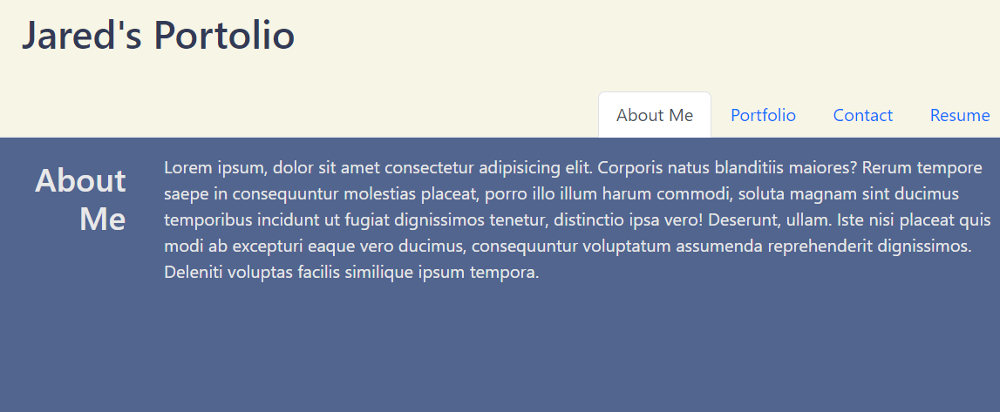

# Portfolio 2.0

## Description

This is a remake of my first big project, making my portfolio. I was definitely hoping that I would be able to remake my portfolio with one of the final projects and I am very excited to do so after learning React. React is a tremendous tool that allows us to render multiple "pages" into a container seamlessly and easily. I like it more then routes and handlebars for smaller website like this one. It feels great seeing a clean website especially after going back to look at the original portfolio I made. React is a great tool to not only input information but use functions in an easy to understand format. I am only further encouraged to keep learning React to expand my expertise.

## Installation

If you are not using the URL provided below, please make a copy of the repo to your drive. Open your terminal and run `npm i`. After installation is complete run `npm start`. At which point the site will open up using your localhost port 3000.

[Click this link to open page](https://spmfd.github.io/Portfolio/)

## Usage

## Credits

